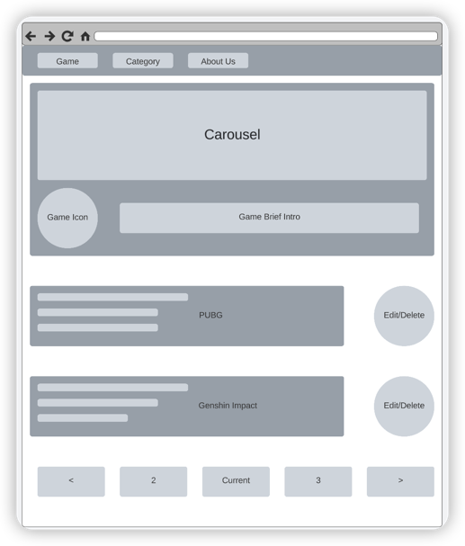

# game-loft
game-loft is a website for searching game info.

# 1. To-do list:

### Backend logic:

> RBAC Impl
> Registration/Login CRUD
> Game CRUD
> Category CRUD

### Frontend pages:
> Registration/Login
> Game Paging/Detail
> Category Listing/Detail
> About us

# 2. Tech Stack:

> PHP/MySQL/Vue/Docker/Nginx/Kubernetes

# 3. ORM Design:

> [!orm.png]

# 4. SiteMap:

> 

> Login Dashboard
> Avatar : Profile | Sign Out
> About Us: 
> Game: Paging | Detail | Create | (Only game creator can edit/delete)
> Category: Paging | Detail | Create | (Only category creator can edit/delete)

# 5. Requirements:

> visitor can view front page content and first 5 game preview
> Registered users can:
    - create games/categories
    - delete、edit games/categories
    - view all games/categories